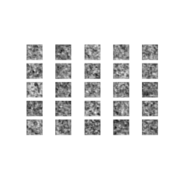

**Target**: Learn about GANS and implement them in Tensorflow/Keras

**Today's Progress**: Implemented traditional GAN on Fashion Mnist dataset in Keras and the results were okay

**Thoughts:**  GANS are highly unstable to train since it is a Mini-Max game where two players compete in this case Generator and Discriminator. Next I will try to implement Pix2Pix GAN should see how it goes.

**Notes:**
<ol>
  <li> Use ReLU activation in all layers of generator except last layer which uses tanh</li>
  <li>Use LeakyReLU activation in all layers of discriminator except last layer which in this case uses sigmoid activation</li>
  <li> Use BatchNorm in all layers except last layer in Generator and Discriminator.</li>
  <li>Use a learning rate of 0.0002 as GANS are highly unstable </li>
</ol>

**Demo**: 

**Link to work:** [DCGAN Fashion MNIST](https://colab.research.google.com/drive/1-pqZOyBAL6C7rW9zVPkuNXROfLRBnML6#scrollTo=UTXnRtlv0bdZ)
